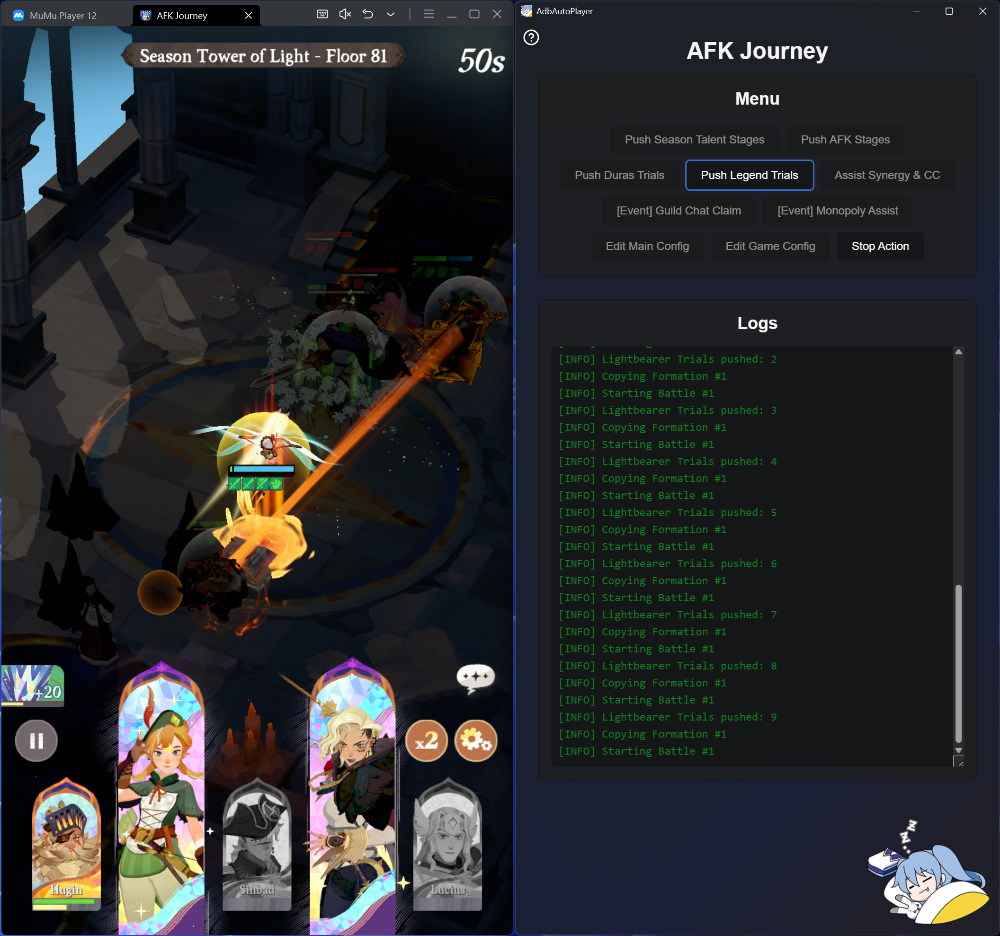

# AdbAutoPlayer

## [Click Here to Access the Full Documentation and Usage Details](https://yulesxoxo.github.io/AdbAutoPlayer/)


## Supported Games
- AFK Journey

## Go Build
```shell
cd .\cmd\wails\
wails build -devtools
```

## Windows pre-commit
```shell
pip install -r .\requirements-dev.txt
pre-commit install
```

## MacOS pre-commit
```shell
brew install pre-commit
pre-commit install
```

## [Python Build](python/README.md)

## [Frontend Build](frontend/README.md)

## Testing .github scripts
### Windows build_zip.ps1
```powershell
$env:GITHUB_WORKSPACE = "C:\Users\$env:USERNAME\GolandProjects\AdbAutoPlayer"; .github\scripts\build_zip.ps1
```

### MacOS build_zip.sh
```shell
GITHUB_WORKSPACE=/Users/$USER/GolandProjects/AdbAutoPlayer bash ./.github/scripts/build_zip.sh
```

## Contact
### AFK Journey
[Discord: Yaphalla](https://discord.gg/yaphalla)  
[Channel: yules](https://discord.com/channels/1332082220013322240/1338732933057347655)
### General
[](https://discord.com/users/518169167048998913)
