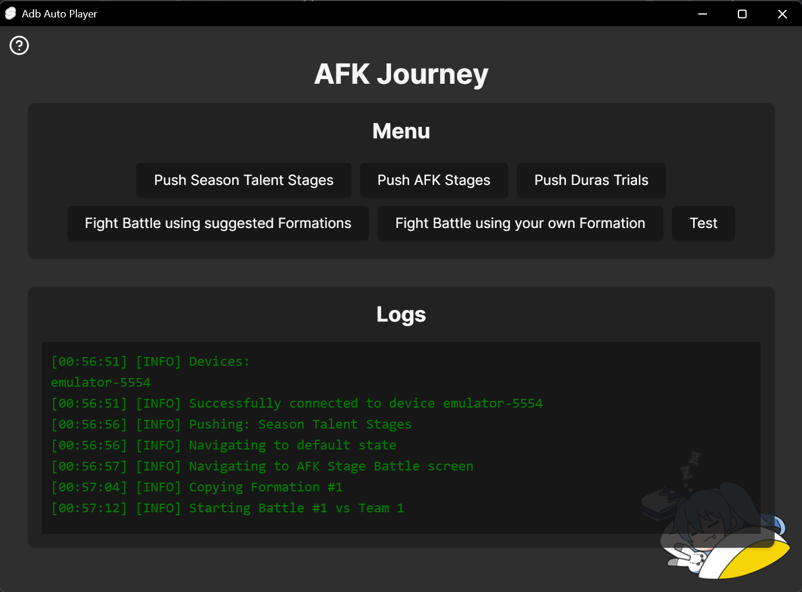

# AdbAutoPlayer

[Click Here to Access the Full Documentation and Usage Details](https://yulesxoxo.github.io/AdbAutoPlayer/)


## Windows Native Setup
1. Install [Python](https://www.python.org/downloads/)
2. Install [Poetry](https://python-poetry.org/docs/#installing-with-the-official-installer)
3. Create virtualenv and install
   ```shell
   poetry shell
   poetry install
   poetry run pre-commit install
   ```

## MacOS Setup
1. Install [Python](https://formulae.brew.sh/formula/python@3.12)
2. Install [Poetry](https://python-poetry.org/docs/#installing-with-pipx)
3. Install [Adb](https://formulae.brew.sh/cask/android-platform-tools)
4. Create virtualenv and install
   ```shell
   poetry shell
   poetry install
   poetry run pre-commit install
   ```

## Contact
[Discord](https://discord.com/users/518169167048998913)
