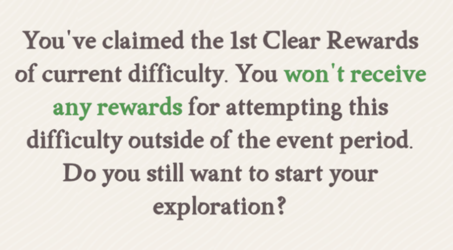
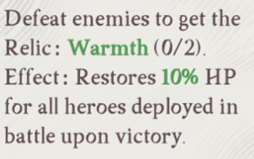
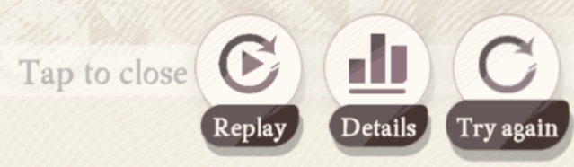
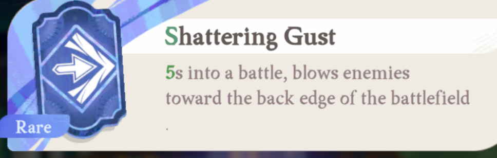

# 📝 TODO List

If you wish to contribute take a look at following tasks. Unless stated otherwise, feel free to reach out to @yulesxoxo for questions or guidance.

[](https://discord.com/users/518169167048998913)

## 🐍 Backend Development

### GFL2 Daily Automation
**Status:** In Progress  
**Assignee:** @valextr  


### Backend Refactor (Second Pass)
**Status:** In Progress  
**Assignee:** @valextr  


### Multi-Touch Gesture Implementation (PoC)
**Status:** Open for contribution  
**Priority:** High  
**Library:** [uiautomator2](https://github.com/openatx/uiautomator2)

**Background:** ADB cannot handle multi-touch gestures directly. The uiautomator2 library provides capabilities for:
- Coordinate-based tapping (`d.click(x, y)`)
- Screenshots (`d.screenshot()`)
- Multi-touch gestures (swipe, pinch, etc.)

**Goals:**
- Create a proof of concept for multi-touch gesture implementation
- Focus on pinch gestures for zoom functionality in games

**Nice to Have:**
1. Explore additional uiautomator2 features relevant to game automation
2. Performance comparison between uiautomator2 and standard ADB implementation for shared features
3. Benchmark testing for shared features (tap, screenshot, swipe)

### OCR Implementation (PoC)
**Status:** Open for contribution  
**Priority:** High
**Focus:** Performance and compatibility testing

> [!NOTE]
> Note: Keep implementation separate from main codebase during evaluation phase.

**Objective:** Evaluate OCR libraries for potential integration as an addition to template matching. Key considerations:
- CPU, GPU, and memory usage optimization
- Compatibility with lower-power PCs
- Reliability

**Test Cases (using AFK Journey):**
1. Header/Title text recognition  
   
2. UI label detection  
   
3. Popup text extraction  
    
4. Arcane Lab gate titles and descriptions  
     
     
5. Battle icon text  
   
6. Arcane Lab crest information  
   

---

## 🎨 Frontend Development

### Custom Routine Component Enhancement
**Status:** Design phase - seeking UI/UX input and/or developer
**Current State:** Basic functionality implemented  
**Proposed Improvement:** Drag-and-drop interface

**Ideas:**
- Redesign current component for better UX
- Support for multiple routine management
- Intuitive drag-and-drop functionality

---

## 📚 Documentation

### Emulator Setup Guides
**Status:** Open for contribution  
**Scope:** Create comprehensive setup guides for popular Android emulators

**Format:** Individual `.md` files per emulator

> [!NOTE]
> Note: Contributors can focus on their preferred emulator - complete coverage by single contributor not required.

**Missing Emulators:**
- BlueStacks
- MuMu Player
- LDPlayer
- MuMu Pro (Mac)
- BlueStacks Air (Mac)

**Content Requirements:**
- Default device ID configuration
- ADB enabling instructions
- Recommended settings
- Multi-instance device ID identification

### Physical Device Setup Guide
**Scope:** Android phone/tablet configuration for automation

**Required Topics:**
- USB debugging activation
- Wireless debugging setup (optional)
- Device ID identification
- Display resolution configuration
- Security considerations

### Custom Routine Documentation
**Status:** Open for contribution  
**Scope:** User guide and examples for custom routine feature

**Requirements:**
- Feature explanation and workflow
- Practical examples (AFK Journey as reference)

## 🎮 AFK Journey Specific

### Fishing
**Status:** Open for contribution  
**Priority:** Lowest

Often requested but never picked up because it is not very useful.  
Template Matching is probably not suitable for this.
Rough from @yulesxoxo: Can be attempted using a heatmap approach.

Also check the Show Debug Info command in the App to get your tap input delay.  
```txt
[INFO] --- Testing Input Delay ---
[INFO] Average time taken to tap screen 10 times: 10.89 ms
```  
At high input delay values you would have to implement Optical Flow (estimate motion direction and velocity).  

### Feature Documentation Overhaul
**Status:** Open for contribution  
**Scope:** Complete features section in AFK Journey documentation

**Requirements:**
- Comprehensive feature list
- Usage instructions
- Configuration options
- Examples and screenshots

---

## Getting Help

- **Discord:** Use the badge above to reach out directly
- **Issues:** Create a GitHub issue for bugs or feature requests
