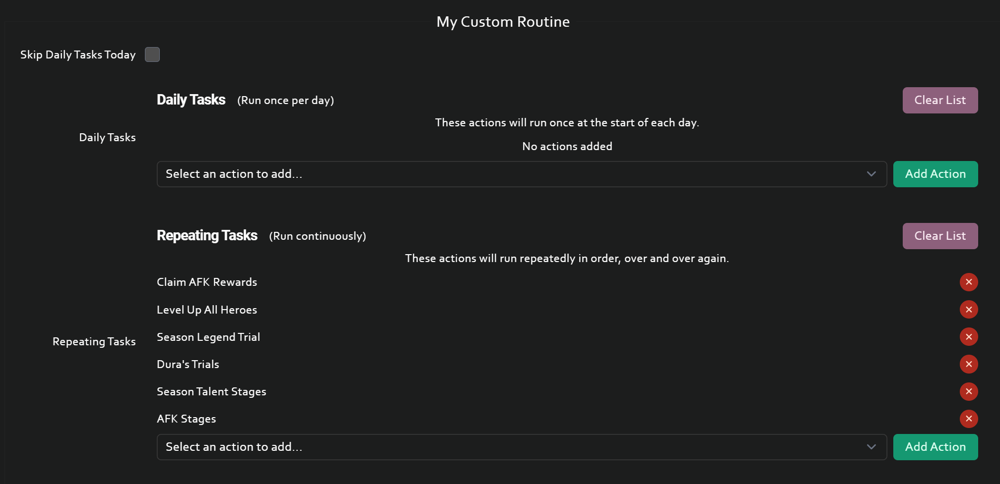

# 📝 TODO List

Unless stated otherwise feel free to reach out to @yulesxoxo  
  

## 🐍 Python
### GFL2 Daily automation 
@valextr
### Refactor backend second pass 
@valextr

### PoC multi-touch hand gestures: https://github.com/openatx/uiautomator2
Need to check what the uiautomator2 library is capable of at cursory glance:
- Tap by coordinate (d.click(x, y))
- Screenshots (d.screenshot())
- Hand gestures such as: swipe, pinch, general multi-touch gestures

ADB is not capable of doing multi-touch gestures directly. This is where uiautomator2 comes in play.  
Pinching specifically comes to mind because that is used in many games to zoom in or out.

Goal: Create a Proof of Concept for multi-touch hand gesture implementation.

Nice to have:
1. Check if uiautomator2 has any other features that work with games that could be relevant to us.
2. Check uiautomator2 source code to see if tap, screenshot and swipe (other shared features?) differs from normal adb implementation if yes benchmark to see which is faster.

### PoC OCR
Choosing a library (or testing multiple libraries) and write some initial tests and standalone functions (keep it in a separate module and do not integrate into the rest of the app) to evaluate CPU, GPU and/or Memory usage.  
The big question here is if this is a feature that can reliably work on lower power PCs.  
In some places OCR can be used instead of template matching to speed up development time and/or get more predictable behavior which would enable making more advanced features in a reasonable time.

Sme tests using AFK Journey as example:
1. Header/Title Text  

2. "Labels"  

3. Popup Text  

4. Arcane Lab Gate Title Text  

5. Arcane Lab Gate Body Text  

6. Battle Icon Text  

7. Arcane Lab Crest Title/Body Text  

## 🎨 Frontend
### Improve the Custom Routine component  
  
Initial thoughts are having it work drag and drop instead. But also need ideas on designs for multiple Routines and so on...

## Docs
### Guides for Emulators
If you want to pick this up don't feel stressed into doing all of them it is completely sufficient to only do one for the Emulator you are actually using.

I think it would be easiest to have an .md file per Emulator.
Rough Idea:  
#### BlueStacks
  1. Default Device ID (`127.0.0.1:5555`)
  2. Recommended Settings (and how to enable ADB)
  3. How to find the device ID in BlueStacks Multi Instance Scenario
  4. other ideas?

Same for MuMu, LDPlayer, MuMu Pro (Mac), BlueStacks Air (Mac). 

### Guide for using with Phone/Tablet
Contact to discuss or make a PR and we will discuss after. This will be mostly left up to you.
Should include: enabling usb debugging, (enabling wireless debugging), how to get the device id,  resizing display, ...

### Custom Routine examples/explanation
Contact to discuss or make a PR and we will discuss after. This will be mostly left up to you.
AFKJ can be used as example but a general explanation of how the feature works in the docs would be nice.

## AFK Journey
### Docs: Features section needs to be redone
Contact to discuss or make a PR and we will discuss after. This will be mostly left up to you.
