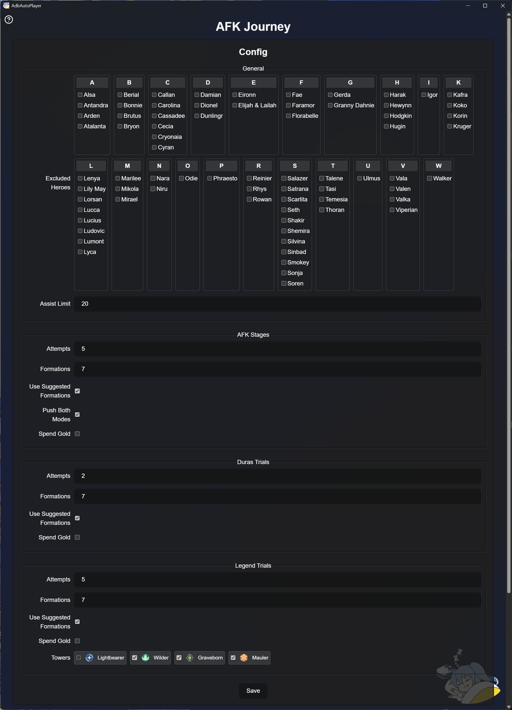

# AFK Journey
> [!IMPORTANT]
> Set the game language to English.

## Supported Resolutions:
> [!IMPORTANT]
> Use 1080x1920 if possible. Other resolutions are not tested.

- **9:16** e.g. **1080x1920**, **900x1600**, **720x1280**, ...

## Features
- **Automated Stage Progression**:
  - Supports *Season Talent Stages*, *AFK Stages*, *Dura's Trials*, and *Legend Trial*.
  - Loads suggested formations, starts battles, and progresses to the next stage automatically.

- **Assist Synergy & CC**: Farms Synergy requests and Corrupt Creature battles for **Guild Quest** and **Pal-Coins**.

- **[Event] Guild Chat Claim**: Claims rewards in Guild Chat, e.g. Happy Satchels.

- **[Event] Monopoly Assist**: Farms assists in Monopoly Log for Pal-Coins.

---

## Configuration Details
> [!NOTE]
> Use the Edit Game Config button in the GUI to change the config!

Configuration can be found under `games/afk_journey/AFKJourney.toml`.
Configuration is loaded when you click any Action.

### General

- **Excluded Heroes**: Formations including selected Heroes will be skipped.

- **Assist Limit**: Defines the number of Synergy or CC assists before stopping.
---

### Common Battle Settings

These settings apply to **AFK Stages**, **Dura's Trials**, and **Legend Trials**:

- **Attempts**: Specifies how many times to attempt each formation.

- **Formations**: Defines the number of suggested formations to copy.

- **Use Suggested Formations**:
  - Enabled: Uses suggested formations from the `Records` button.
  - Disabled: Uses your current formation.

- **Spend Gold**:
  - Enabled: Gold will be spent to continue retrying after failure.
  - Disabled: Gold will not be spent to keep retrying the trials.

### AFK Stages

- **Push Both Modes**: If enabled, the bot will try the other mode after failing all attempts on all formations.
- **Repeat**: If enabled, the bot will retry from the start after failing all attempts

### Legend Trials

- **Towers**: Any unselected tower will be skipped.
