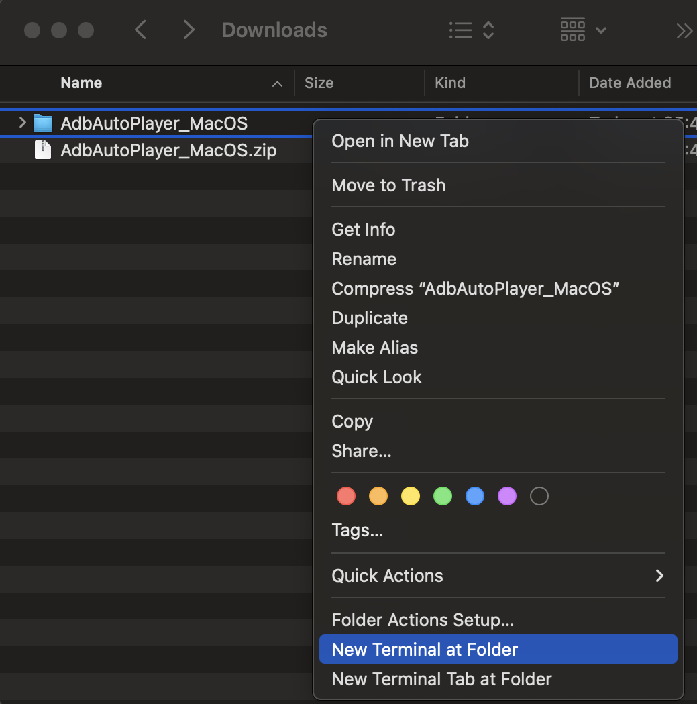

# MacOS Setup

## Installation
1. Download [AdbAutoPlayer_MacOS.zip](https://github.com/yulesxoxo/AdbAutoPlayer/releases/latest) and unzip it
2. Install [MuMuPlayer Pro](https://www.mumuplayer.com/mac/)
3. Install [Homebrew](https://brew.sh/)
4. Install [Adb](https://formulae.brew.sh/cask/android-platform-tools)

## MumuPlayer Pro
1. Settings => Display => Display Size Phone => Set Device Display to 1080x1920
2. Settings => Other => Enable ADB: "Try to use the default port (5555)"
3. Start the Android Device
4. Install and start any supported game
5. Start a Terminal and type  
    ```shell
    adb devices
    ```
6. If no devices are listed go to MuMuPlayer and Open ADB  
    
7. Minimize and ignore the Terminal that MuMuPlayer
8. Start a Terminal and type check if there should be a device now.  
    ```shell
    adb devices
    ```

## AdbAutoPlayer
1. Open `main_config.toml`,change id `'emulator-5554'` to an id from your `adb devices` output
2. Open a new terminal and navigate to the `AdbAutoPlayer_MacOS` directory  
   
3. You can now execute AdbAutoPlayer  
    ```shell
    ./AdbAutoPlayer
    ```
