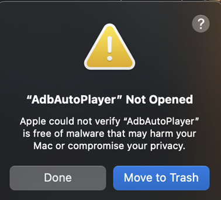
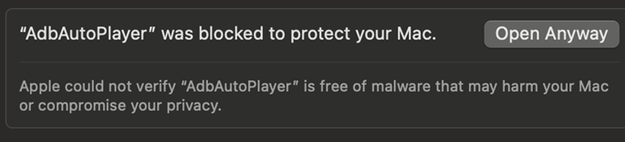
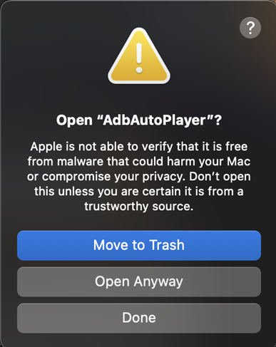
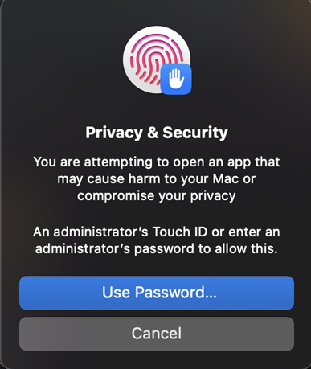
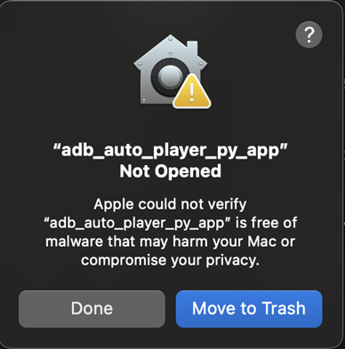
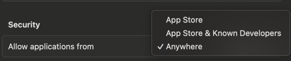

# macOS Setup Guide

This guide walks you through setting up **AdbAutoPlayer** on macOS (Apple Silicon).

> [!IMPORTANT]
> Check [Emulator Settings](emulator-settings.md) if you haven't already!

---

## Installation Steps

### 1. **Download the Tool**
- Get the latest release of **AdbAutoPlayer**:
  [AdbAutoPlayer_MacOS.zip](https://github.com/yulesxoxo/AdbAutoPlayer/releases/latest).
- Extract the `.zip` file to a folder on your computer.

### 2. **Install Homebrew**
- Follow the instructions at [brew.sh](https://brew.sh/) to install **Homebrew**, a package manager for macOS.

### 3. **Install ADB via Homebrew**
- Use Homebrew to install the Android Debug Bridge (ADB):
  ```bash
  brew install --cask android-platform-tools
  ```

---

## Starting AdbAutoPlayer

macOS may block the app because it lacks a code signing certificate. Here's how to open it:
> [!IMPORTANT]
> This will happen after every update.


1. Double-click the app. You'll see this prompt:
   
   Click **Done**.

2. Go to **System Settings** → **Privacy & Security**, scroll to the bottom, and find:
   
   Click **Open Anyway** and keep this open you will need it again later.

3. Double-click the app again. If prompted, click **Open Anyway** again:
   

4. If you see this security prompt:
   
   Use your Touch ID or password.

5. The app will open a Terminal window. Leave it open and use the GUI
6. When you click any action button on the App you will get another blocked prompt:
   
    Repeat Step 2 and try clicking the button again.

## Disable Security (Optional not recommended)

The security prompt from the previous step can be really annoying and will happen on every update. If you want a workaround you can try typing this into terminal:
```shell
sudo spctl --master-disable
```
This will add the option to allow apps from anywhere:  


# Continue to the [Troubleshooting Guide](troubleshoot.md)
