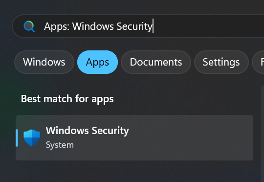
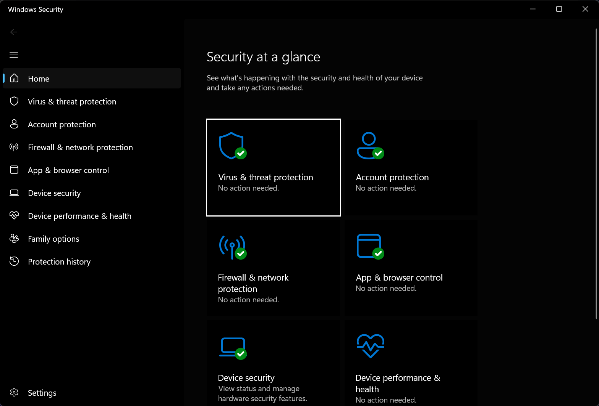
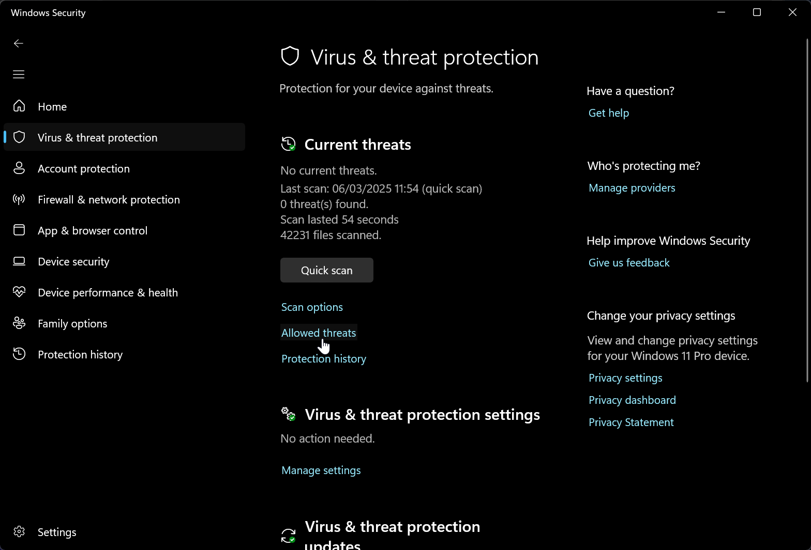
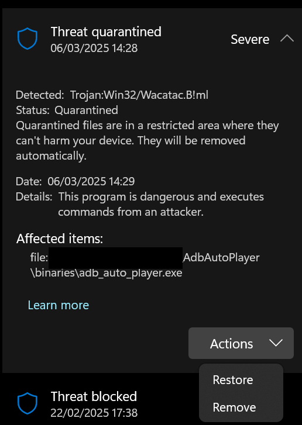
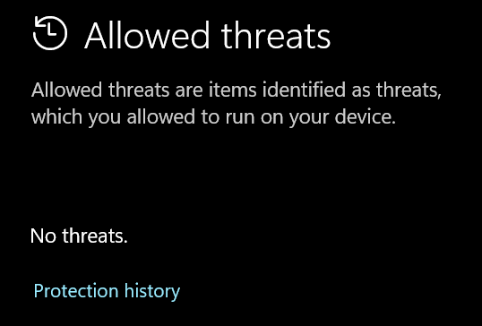

# Troubleshooting

## General try disabling Device Stream
If Device Streaming is active try unchecking it and see if your problem goes away.  
If your problem does NOT go away activate it again.  

## Emulator
> [!NOTE]
> Test both [MumuPlayer](https://www.mumuplayer.com/) and [BlueStacks 5](https://www.bluestacks.com/)

## This bot only works in Portrait mode
1. Please double-check your [Emulator Settings](emulator-settings.md).  
2. If the game automatically switches to Landscape on start, use the Rotate Menu and select Portrait.  

## Missing files
This issue usually occurs due to one of the following reasons:

1. **Windows Security or another Antivirus software flagged a false positive** and deleted/quarantined one or more files. Learn more about [false positives](https://encyclopedia.kaspersky.com/glossary/false-positive).
2. **An error occurred during the update process**, preventing all files from being properly installed.
3. **You didn’t extract all files from the .zip** or moved the **.exe** to a different directory, causing missing dependencies.

Make sure to extract all files and check your antivirus settings to prevent accidental deletions. 

## File contains a virus or potentially unwanted software
1. Search **Windows Security**  
    
2. Select **Virus & threat protection**  
    
3. Click **allowed threats**  
    
4. Search for a Threat that has **AdbAutoPlayer** or **adb_auto_player** in the file name or path then click **Actions** and **Restore**  
    
5. If you have no Threats click **Protection history** and check there then do the same as step 4.  
    

## Tap to restart this app for a better view
  
Some games will not automatically scale when the resolution changes. You simply have to press the button and the bot will work.
