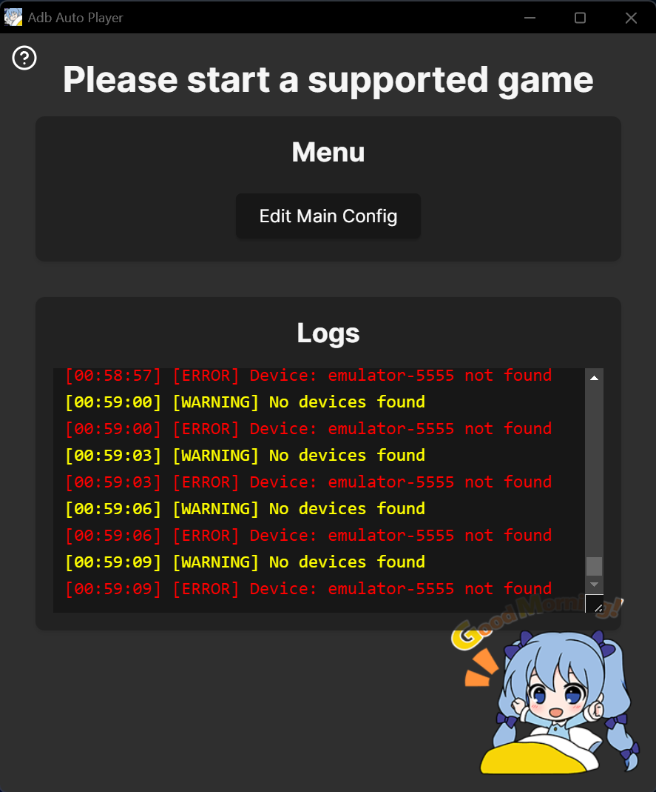
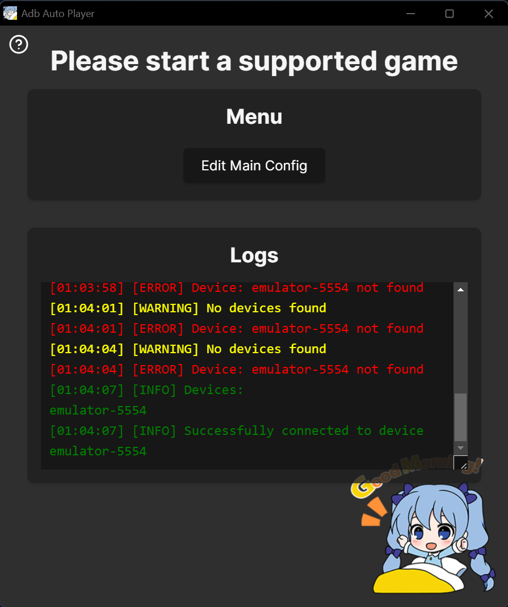
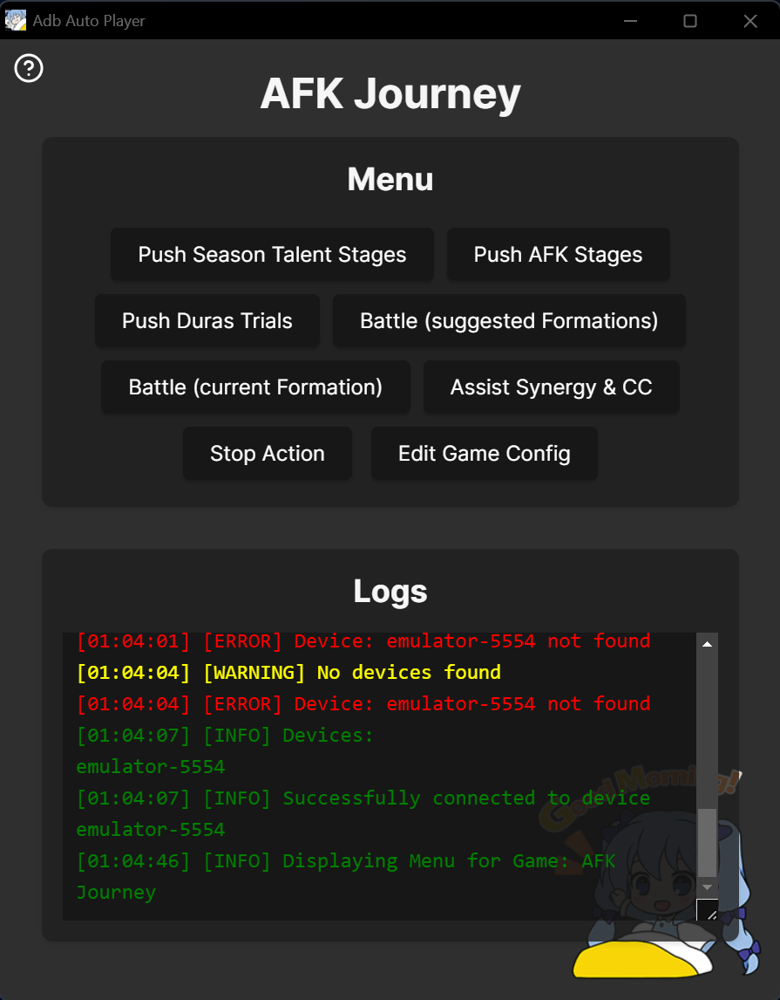

# Troubleshooting

## Error: *"Failed to connect to the device: No devices found"*
> TODO: update screenshot

  
- This error means no ADB devices were detected.  
### Windows
- Start **LDPlayer** and check the [Windows Setup Guide](windows-setup.md) if LDPlayer is configured correctly and running this should not happen

### macOS
- Start **MuMuPlayer**, then go to **Tools** → **Open ADB**:  
  
- Minimize and ignore the terminal window that opens.

---

## Error: *"Failed to connect to the device: device 'xyz' not found"*
> TODO: update this config is now edited directly in the GUI

1. Open the `main_config.toml` file in the **AdbAutoPlayer_MacOS** directory.  
2. Locate the `id` field and update the value with the device ID visible in the logs (the first device shown in green).
3. Save the file and click **Reload main_config.toml** in the app.

---

### Success!
> TODO: update screenshot  

Once connected, you'll see:  

---

## Starting a Game
> TODO: update screenshot  

- Launch a supported game, and the app interface will adapt accordingly:  
  

---

## Notes and Support
- Need help? Reach out on Discord: [@yules](https://discord.com/users/518169167048998913).

### MacOS
- Ensure **ADB Debugging** is enabled in **MuMuPlayer Pro** as described above.  
- If **AdbAutoPlayer** doesn't work, verify:
  - The correct device ID is set in `main_config.toml`.
  - ADB is installed and configured (`adb devices` lists your emulator).  
