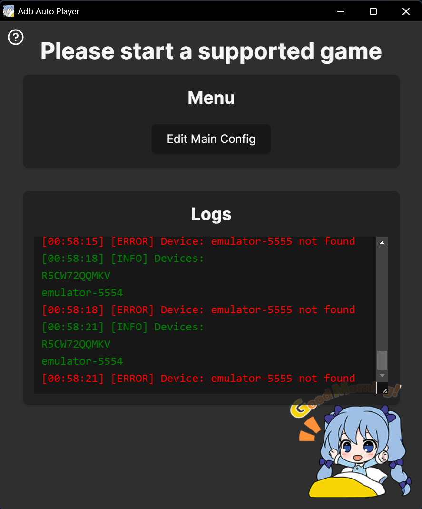
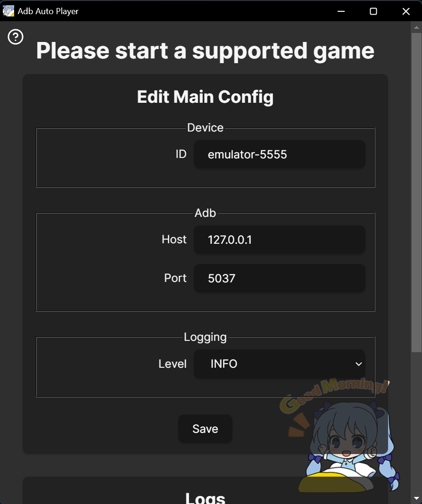

# Troubleshooting

## [WARNING] No devices found
  

This is a Warning that does not necessarily need to be fixed. You can try following things:

### Windows
- Start **LDPlayer** and check the [Windows Setup Guide](windows-setup.md) if LDPlayer is configured correctly and running this should not happen

### macOS
- Start **MuMuPlayer**, then go to **Tools** → **Open ADB**:  
  
- Minimize and ignore the terminal window that opens.

---

## [ERROR] Device: <device_id> not found
  

Click Edit Main Config and change the Device ID to one of the listed Devices, the correct one will most likely be `emulator-<number>`

---

### Success!
Once connected, you'll see:  

---

## Starting a Game
- Launch a supported game, and the app interface will adapt accordingly:  
  

---

## Notes and Support
- Need help? Reach out on Discord: [@yules](https://discord.com/users/518169167048998913).

### MacOS
- Ensure **ADB Debugging** is enabled in **MuMuPlayer Pro** as described above.  
- If **AdbAutoPlayer** doesn't work, verify:
  - The correct device ID is set in `main_config.toml`.
  - ADB is installed and configured (`adb devices` lists your emulator).  
