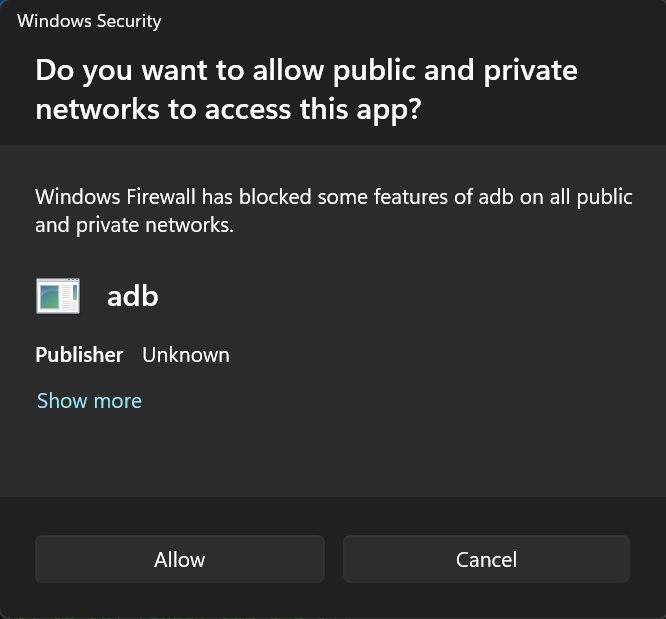

# Windows Setup Guide

This guide will walk you through setting up **AdbAutoPlayer** on Windows.

> [!IMPORTANT]
> Check [Emulator Settings](emulator-settings.md) if you haven't already!

---

## Installation

1. **Download the Tool**
   - Get the latest release of **AdbAutoPlayer**:
     [AdbAutoPlayer_Windows.zip](https://github.com/yulesxoxo/AdbAutoPlayer/releases/latest).
   - Extract the contents of the `.zip` file to a folder on your computer.

---

## Starting AdbAutoPlayer

When launching AdbAutoPlayer, Windows Defender SmartScreen may block the application. To proceed:
1. Click the **More info** link.
2. Click the **Run anyway** button that appears.
3. Wait for the application to start.

---

## Windows Security pop up

If this pop up appears simply click **Allow**. If you want more info read here: [**ADB (Android Debug Bridge)**](https://developer.android.com/tools/adb)

# Continue to the [Troubleshooting Guide](troubleshoot.md)
