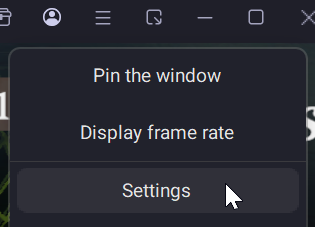
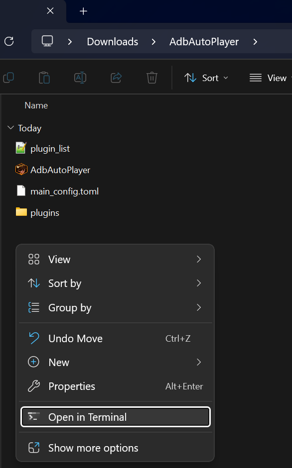

# Windows Setup

This guide will walk you through setting up **AdbAutoPlayer** on a Windows system using **LDPlayer** as the emulator.

---

## Installation

1. **Download the Tool**  
   - Get the latest release of **AdbAutoPlayer**:  
     [AdbAutoPlayer_Windows.zip](https://github.com/yulesxoxo/AdbAutoPlayer/releases/latest).  
   - Extract the contents of the `.zip` file to a folder on your computer.

2. **Install LDPlayer**  
   - Download and install **LDPlayer**: [LDPlayer Download](https://www.ldplayer.net/).

---

## Configuring LDPlayer

1. **Start LDPlayer**  
   Launch the LDPlayer emulator after installation.

2. **Open Settings**  
   Navigate to the settings menu:  
   

3. **Set the Resolution**  
   - Go to **Display**:  
     - **Resolution**: Select **Phone (1080 x 1920)**.

4. **Enable ADB Debugging**  
   - Go to **Others**:  
     - **ADB Debugging**: Enable **Local Connection**.

5. **Save Settings**  
   - Click **Save** and restart the Emulator to apply the changes.

6. **Install and Start a Supported Game**  
   - Install any game supported by **AdbAutoPlayer** and launch it in LDPlayer.

---

## Running AdbAutoPlayer

1. **Open a Terminal**  
   - Navigate to the extracted **AdbAutoPlayer_Windows** folder.  
   - Right-click and select **Open Terminal** (or the equivalent option):  
     

2. **Run the Application**  
   - Enter the following command in the terminal to start **AdbAutoPlayer**:
     ```shell
     .\AdbAutoPlayer.exe
     ```

---

### Notes

- Ensure that **ADB Debugging** is enabled in LDPlayer as described above.  
- If **AdbAutoPlayer** does not recognize the emulator, verify that the terminal is running in the correct folder and that ADB debugging is active.  
- For reach out on Discord: [@yules](https://discord.com/users/518169167048998913).
